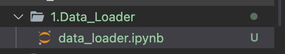
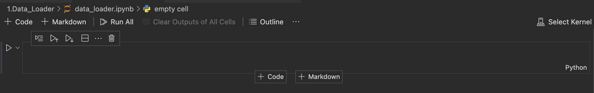
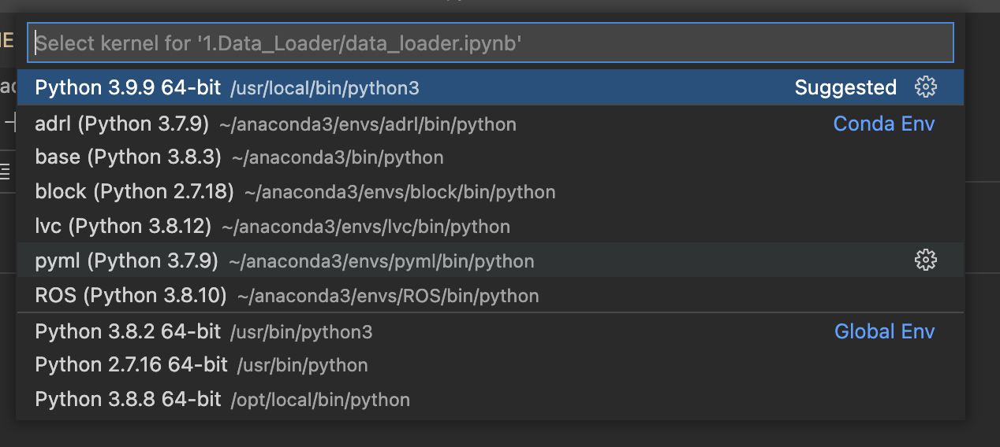
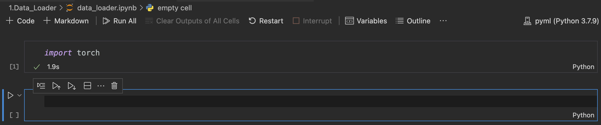

# Code_Seminar

## Code Environment Setting

### Visual Studio Code에 Ipython(Jupyter) 환경 만들기

**Vs code에 파이썬 확장 및 Ipython 실행**  
Computer에 Kernel(conda environment)과 Jupyter가 설치되어있다고 가정

python Extension -> python 검색  
밑에 보이는 python, python for VSCode, Python Extension Pack 설치  
  
  
Code에서 .ipynb 형태로 파일 생성  
  
  
Ipython 창에서 오른쪽 위 Select Kernel 선택  
  

사용하는 Kernel (Conda environment) 선택 - pytorch가 설치되어있는 pyml 선택함
  

오른쪽 상단의 Kernel이 pyml로 변경되고, Cell에 pytorch를 import
  
