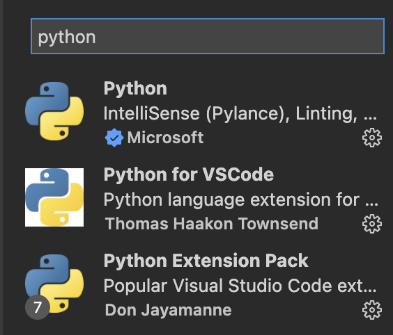

# Code_Seminar

## Code Environment Setting

> Visual Studio Code에 Ipython(Jupyter) 환경 만들기
> > Vs code에 파이썬 확장 및 Ipython 실행

python Extension -> python 검색
밑에 보이는 python, python for VSCode, Python Extension Pack 설치
